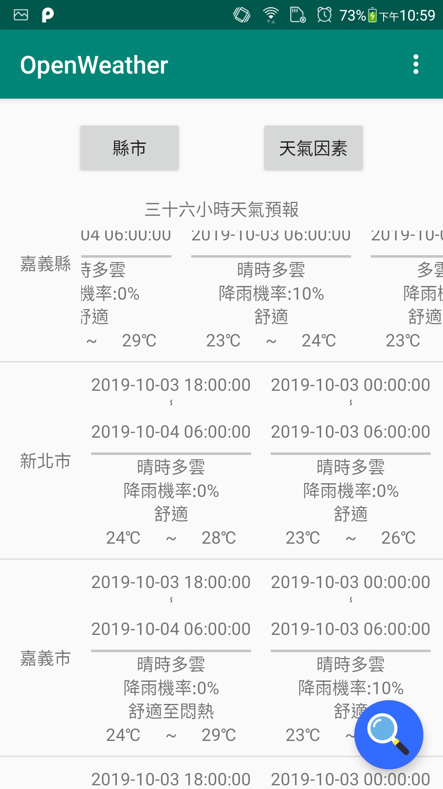
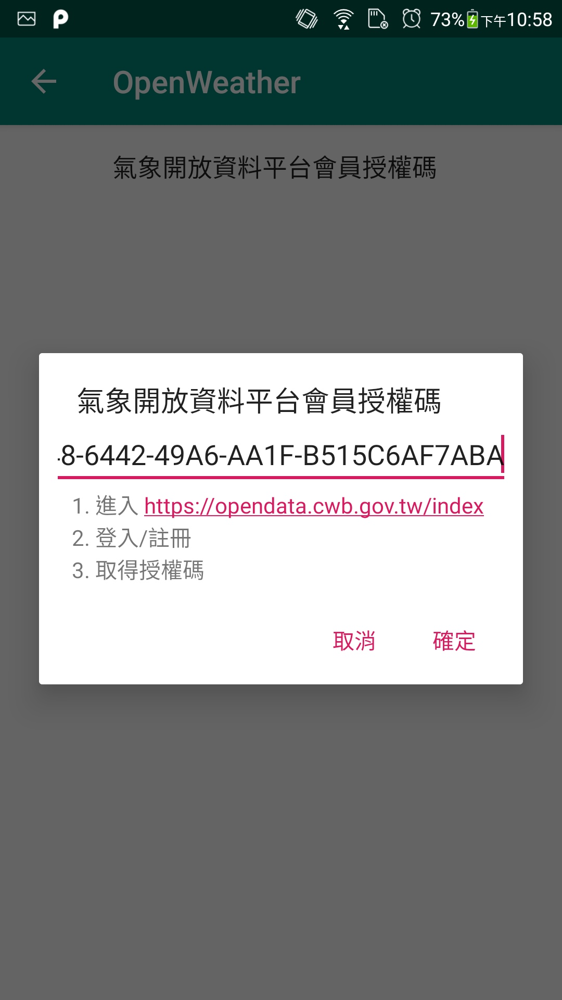
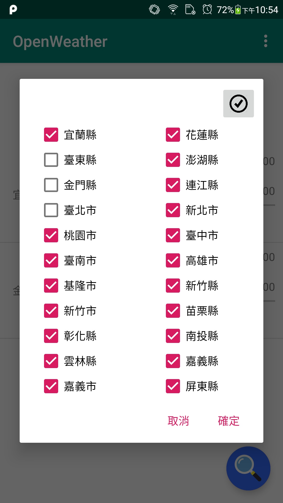
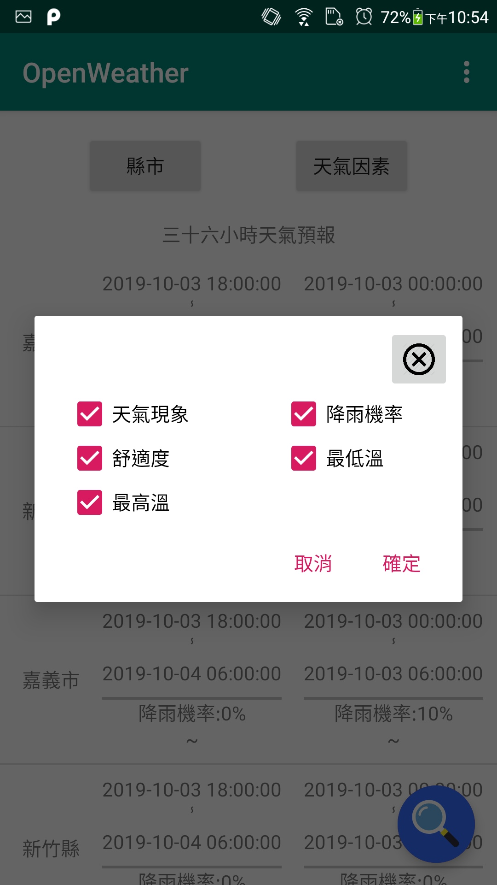

# OpenWeather
A demo project for **Retrofit** using [Open Weather Data](https://opendata.cwb.gov.tw/index)

## Prerequisites
- [XDDLib](https://github.com/adherencegoo/XDDLib): for debugging, but it's ok to remove `implementation project(':XDDLib')` in [app/build.gradle](app/build.gradle) and those debug code without affecting its functionality.

## Screenshots
| Main page: display queried open weather data (nested RecyclerView) | Set authorization value created via the above website |
| :--: | :--: |
|  |  |

| Query params: cities | Query params: weather elements |
| :--: | :--: |
|  |  |

## Techniques
- Retrofit
  - `Interceptor`: used to intercept the common parameter "Authorization" for all retrofit functions (currently, only one `@GET` is implemented)
  - `Converter.Factory`: used to convert a custom type in retrofit function parameter list to a string which is recognizable by server
  - Gson TypeAdapter: serialization and deserialization for custom type
- Architecture components: `LiveData`, `ViewModel`
- DataBinding: variable binding, listener binding, two-way binding, binding adapter
- `Activity`/`Fragment`, `Toolbar`
- Nested `RecyclerView`
